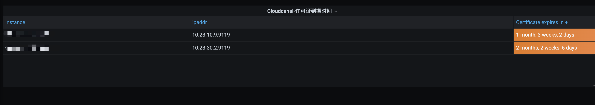

# cloudcanal-exporter

可以获取Cloudcanal许可证过期时间，进行监控。 这只是简单的metrics,如果需要关注别的指标可以自定义二次开发即可。

如有帮助给个Star⭐鼓励一下~️

## 构建

```shell
CGO_ENABLED=0 GOOS=linux go build -a -ldflags '-extldflags "-static"' -o cloudcanal_exporter
```

## 运行

```shell
cloudcanal_exporter --help # help
cloudcanal_exporter -listen-address :9119 -url http://localhost:8111 -username test@clougence.com -password clougence2021
curl http://localhost:9119/metrics # test curl
```

## 样例



## 告警配置
```yaml
groups:
  - name: 'cloudcanal_monitor'
    rules:
      - alert: CloudcanalLicenseExpire
        expr: 'lm_cloudcanal_license_expiry-time() < 86400 * 10'
        for: 10m
        labels:
          severity: critical
          threshold: 10
          for_time: "10m"
        annotations:
          summary: "Cloudcanal license expire(instance {{ $labels.instance }})"
          description: "请注意, Cloudcanal 许可证将要过期, 还有({{ $value }})s < 10天"
```
